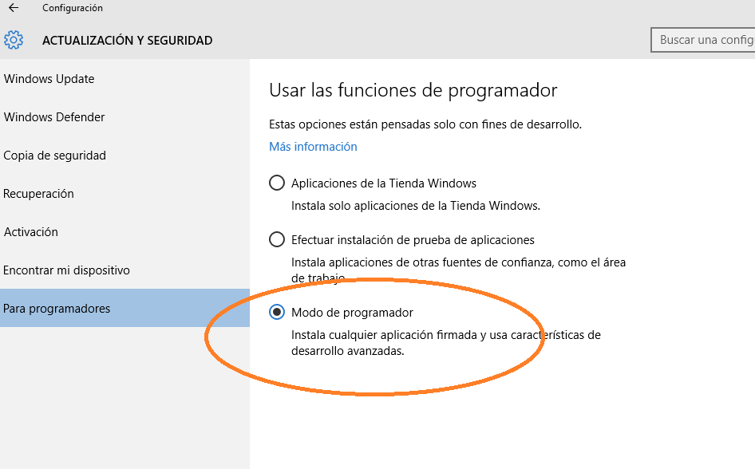

[ ... back  ](../README.md)

# Instal·lació de Visual Studio i UWP

## Visual Studio 2017
Descarregueu-vos VS2017 de Microsoft Imagine
L'assistènt d'instal·lació us farà triar quins mòduls voleu instal·lar. Per 
suportar UWP com a mínim cal seleccionar els següents:

 
 
## Activació del mode de programador
Activeu el mode de programador per tal que el windows 10 sigui capaç d'executar aplicacions UWP que no estiguin
a la Microsoft Store

