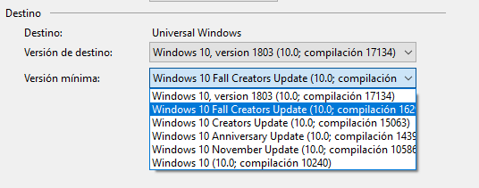
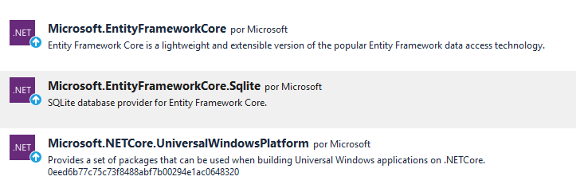
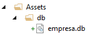
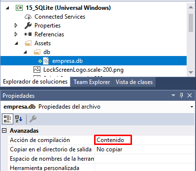

[ ... back  ](../README.md)

# Accés a dades

## Proveïdors SGBD suportats

* SQLite
* MySQL
* SQLServer
* Postgress

## SQLite

### Versió mínima del Windows Platform
    <TargetPlatformMinVersion>10.0.16299.0</TargetPlatformMinVersion>



### Nugets necesaris


| Nuget | Version |
|-----------|-------|
| Microsoft.EntityFrameworkCore | 2.0.1 |
| Microsoft.EntityFrameworkCore.Sqlite|2.0.1|
| Microsoft.NETCore.UniversalWindowsPlatform|6.1.5|

### Creació de base de dades
* Crear un arxiu amb sqlite3.exe
```
	> sqlite3.exe empresa.db
```
* Executar un script sql
```
	 sqlite3> .read guio.sql
```

* Copiar base de dades a _Assets_ del projecte



* Definir la Compile action



### Canvis a App.xaml.cs
```c#
        public App()
        {
            this.InitializeComponent();
            this.Suspending += OnSuspending;
            // Demanar la inicialització de la BD
            InicialitzaBDAsync();

        }

        private async System.Threading.Tasks.Task InicialitzaBDAsync()
        {
            // Assegureu-vos que:
            // a) l'arxiu està a Assets, i l'heu inclòs al projecte
            // b) a les propietats de l'arxius la "Acción de compilación" és "Contenido"

            try
            {
                string name = "empresa.db";
                var dbFolderAppData = ApplicationData.Current.LocalFolder;
                StorageFolder dbFolder = await dbFolderAppData.CreateFolderAsync("db", CreationCollisionOption.OpenIfExists);
                StorageFile dbFile = null;
                try
                {
                    dbFile = await dbFolder.GetFileAsync(name);
                }
                catch (FileNotFoundException ex)
                {
                    // L'arxiu de base de dades no ha estat creat, i per tant cal copiar-lo
                    // des d'Assets
                    var uriArxiuBDAAssets = new Uri("ms-appx:///Assets/db/"+name);
                    StorageFile arxiuBDAssets = await StorageFile.GetFileFromApplicationUriAsync(uriArxiuBDAAssets);
                    dbFile = await arxiuBDAssets.CopyAsync(dbFolder, name, NameCollisionOption.FailIfExists);
                }
            }
            catch (Exception ex)
            {

            }

        }

```

### StackPanel
Té un únic requisit: definir l'atribut *Orientation*, amb valors _Vertical_ o _Horizontal_.
Decidiu si el voleu horitzontal o vertical i els elements a dins s'apilen segons aquesta orientació.
```xml 
        <StackPanel Orientation="Vertical">
            <TextBox x:Name="txbLogin" PlaceholderText="Login"></TextBox>
            <TextBox x:Name="txbPassword" PlaceholderText="password"></TextBox>
            <Button x:Name="btnLogin" Content="Login" HorizontalAlignment="Stretch"></Button>
        </StackPanel>
```
		
### Grid

Les graelles permeten definir files i columnes usant *Grid.ColumnDefinitions* i *Grid.RowDefinitions*
Les mesures poden ser:
* en pixels ( un número simple )
* "percentuals", posant un asterisc precedit d'un pes en tant per 100 o qualsevol altre base ( 5*) 
* ajustat als continguts (auto)

```xml
<Grid > 
	<Grid.ColumnDefinitions >
		<ColumnDefinition Width="auto"></ColumnDefinition>
		<ColumnDefinition Width="70*"></ColumnDefinition>
		<ColumnDefinition Width="30*"></ColumnDefinition>
		<ColumnDefinition Width="40"></ColumnDefinition>
	</Grid.ColumnDefinitions>
```

Per assignar un element a una casella de la graella, cal afegir un atribut _Grid.Column=""_ i/o _Grid.Row=""_
, i opcionalment podeu afegir _Grid.ColumnSpan=""_ i _Grid.RowSpan=""_ si voleu que l'element ocupi vàries columnes o vàries files respectivament.

    

### Programació dinàmica d'Events

```c#     
{
	Button b = new Button();

	b.Click += Button_Click; // assignem dimàmicament el mètode de gestió de l'event Click
}
private void Button_Click(object sender, RoutedEventArgs e)
{
	// event de click
}

```


### Estils bàsics

#### Definició d'un estil genèric per a botons

Fixeu-vos que es posa a _Page.resources_:
```xml
<Page.Resources>
    <Style TargetType="Button">
        <Setter Property="BorderThickness" Value="5" />
        <Setter Property="Foreground" Value="Black" />
        <Setter Property="BorderBrush" >
            <Setter.Value>
                <LinearGradientBrush StartPoint="0.5,0" EndPoint="0.5,1">
                    <GradientStop Color="Yellow" Offset="0.0" />
                    <GradientStop Color="Red" Offset="0.25" />
                    <GradientStop Color="Blue" Offset="0.75" />
                    <GradientStop Color="LimeGreen" Offset="1.0" />
                </LinearGradientBrush>
            </Setter.Value>
        </Setter>
    </Style>
</Page.Resources>
```

#### Definició d'un estil amb clau (x:Key):

```xml
    <Style x:Key="PurpleStyle" TargetType="Button">
        <Setter Property="FontFamily" Value="Segoe UI"/>
        <Setter Property="FontSize" Value="14"/>
        <Setter Property="Foreground" Value="Purple"/>
    </Style>
```

#### Aplicació de l'estil:

```xml
<Button Content="Button" Style="{StaticResource PurpleStyle}"/>
```

#### Herència d'estils:

Podem heredar l'atribut "BasedOn" per crear l'estil a partir d'una base.
```xml
    <Style x:Key="BasicStyle" TargetType="ContentControl">
        <Setter Property="Width" Value="130" />
        <Setter Property="Height" Value="30" />
    </Style>

    <Style x:Key="ButtonStyle" TargetType="Button"
           BasedOn="{StaticResource BasicStyle}">
        <Setter Property="BorderBrush" Value="Orange" />
        <Setter Property="BorderThickness" Value="2" />
        <Setter Property="Foreground" Value="Red" />
    </Style>
```

###  TextBox
Events principals del TextBox:

#### Event _TextChanged_

```c#
        private void TextBox_TextChanged(object sender, TextChangedEventArgs e)
        {
            
            TextBox tb = (TextBox)sender;
            string textDelTextBox= tb.Text;
        }
```		
#### Event _KeyDown_ i _KeyUp_

```c#
        private void txtNumeric_KeyDown(object sender, KeyRoutedEventArgs e)
        {
            if( !( e.Key.ToString().StartsWith("Number") )){
                e.Handled = true;
            }
        }
```
### Diàlegs simples

```c#

	ContentDialog noWifiDialog = new ContentDialog
	{
		Title = "Atenció",
		Content = "Vol Sortir de l'aplicació el disc dur?",
		PrimaryButtonText = "Ok",
		SecondaryButtonText = "No",
	};

	ContentDialogResult result = await noWifiDialog.ShowAsync();
	if(result==ContentDialogResult.Primary)
	{
		Application.Current.Exit();
	}  
```

### ListBox

```xml
        <ListBox x:Name="lsbPreguntes" 
			SelectionChanged="lsbPreguntes_SelectionChanged">
            <ListBoxItem>1</ListBoxItem>
            <ListBoxItem>2</ListBoxItem>
            <ListBoxItem>3</ListBoxItem>
        </ListBox>
```
L'event princiapl és _SelectionChanged_, que es disapara cada vegada que l'usuari
 tria un ítem diferent sobre la llista:
````c#
        private void lsbPreguntes_SelectionChanged(object sender, SelectionChangedEventArgs e)
        {
            int indexItemSeleccionat = lsbPreguntes.SelectedIndex;
            string textSeleccionat = lsbPreguntes.SelectedItem.ToString();
        }
````

*PENDING*: Exemple de ListBox multiselecció

### CheckBox

### RadioButton 

Agrupem 
```xml
	<StackPanel>
			<RadioButton Content="Blue" GroupName="BorderBrush" Tag="Blue" Checked="BorderRadioButton_Checked"/>
			<RadioButton Content="White" GroupName="BorderBrush" Tag="White"  Checked="BorderRadioButton_Checked"/>
	</StackPanel>
```			