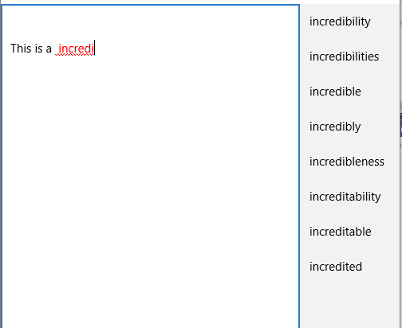
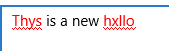
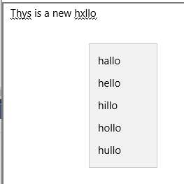

[ ... back  ](../README.md)

# Pràctica 1

## Concepte
A mesura que anem escrivint, se'ns mostra la llista de mots que tenen el mateix començament:


En tot moment (useu l'event _KeyUP_) es valida la sintaxi i es subratllen les paraules errònies:



Si fem right-click sobre la paraula errònia, es donen les possibles alternatives:

Cal contemplar dues possibles variacions sobre la paraula errònia:
* eliminar qualsevol de les lletres
* modificar independentment cadascuna de les seves lletres per qualsevol altra lletra.

*Atenció:* Cal que el vostre corrector ignori punts, comes i d'altres caràcters especials.


## Diccionari

[Arxiu de diccionari](dictionary_english.txt)

## Lectura d'un arxiu:

Cal crear l'arxiu "dictionary_english.txt" dins de la carpeta Assets
i incloure-la al projecte des de Visual Studio

```c#
	var file = StorageFile.GetFileFromApplicationUriAsync(new Uri("ms-appx:///Assets/dictionary_english.txt")).AsTask().Result;
	string text = FileIO.ReadTextAsync(file).AsTask().Result;
 ```
 
 ## Classe Node ( parcial )
 
 ```c#
    class Node
    {
        private char mLetter;
        private Dictionary<char, Node> mChildren = new Dictionary<char, Node>();
        private List<String> mWords = new List<String>();

		public Node(char pLetter)
        {
            mLetter = pLetter;
        }
 
        public char Letter
        {
            get { return mLetter; }
            set { mLetter = value; }
        }


        public void addChildren(Node pNewChildren)
        {
            mChildren[pNewChildren.Letter] = pNewChildren;
        }

        public bool hasChildren(char pLetter)
        {
            return mChildren.ContainsKey(pLetter);
        }
        public Node getChildren(char pLetter)
        {
            if(mChildren.ContainsKey(pLetter))
            {
                return mChildren[pLetter];
            }
            else
            {
                return null;
            }
        }

        public void AddWords(string pWord)
        {
            mWords.Add(pWord);
        }

        public List<string> GetWords()
        {
            return mWords;
        }

        internal IEnumerable<Node> GetChildren()
        {
            return mChildren.Values;
        }
    }
 ```
 
## RichEditBox
 
 ```c#
 RichEditBox reb;
 
 // lectura del text del RichEditBox
 string text;
 reb.Document.GetText(Windows.UI.Text.TextGetOptions.None, out text);
 

 // permet consultar i modificar la posició final de la selecció 
 reb.Document.Selection.EndPosition 
 // permet consultar i modificar la posició inicial de la selecció 
 reb.Document.Selection.StartPosition
 
 // canviant el text de la selecció
 reb.Document.Selection.SetText("CANVI");
 
 // Fer que no hi hagi selecció (inic==fi) --> cursor normal
 reb.Document.Selection.EndPosition =reb.Document.Selection.StartPosition; 
 
 // Formateig de la selecció
ITextCharacterFormat paragraphFormatting;
 
reb.Document.Selection.StartPosition = start;
reb.Document.Selection.EndPosition = end;
paragraphFormatting = reb.Document.Selection.CharacterFormat;


paragraphFormatting.Underline = UnderlineType.DoubleWave;
paragraphFormatting.ForegroundColor = Colors.Red;
					
```

## Menú contextual del RichEditBox
Utilitzeu l'event _ContextMenuOpening_ del RichEditBox.
Aquest event si no es fa res, acaba mostrant el menú contextual per defecte del RichEditBox. Nosaltres el 
volem reemplaçar per un menú contextual propi.

A tal efecte, cal fer una sèrie d'accions:
1. Afegir al final del codi de l'event  el següent fragment, que evita que es mostri el menú contextual per defecte.
```c#
e.Handled = true;
```
2. Crear un menú flotant ( MenuFlyoutItem)
3. Afegir items ( tants com paraules)
4. Cada item s'ha de programar amb un click
5. Cal mostrar el menú a la posició on està el mouse

Trobareu un exemple tot seguit:
```c#
				// exemple de creació de menú
                MenuFlyout fl = new MenuFlyout();
                
				// exemple de creació d'un ítem, programació del click i afegir-lo al menú
				MenuFlyoutItem item = new MenuFlyoutItem();
				item.Click += MenuItem_Clicked;
				item.Text = "PARAULA_AL_MENU";
				fl.Items.Add(item);
                
				// mostrar el menú on està el mouse:
                var pointerPosition = Windows.UI.Core.CoreWindow.GetForCurrentThread().PointerPosition;
                var x = pointerPosition.X - Window.Current.Bounds.X;
                var y = pointerPosition.Y - Window.Current.Bounds.Y;
                fl.ShowAt((FrameworkElement)sender,  new Windows.Foundation.Point(x, y));              

```c#