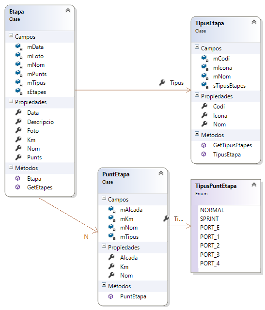
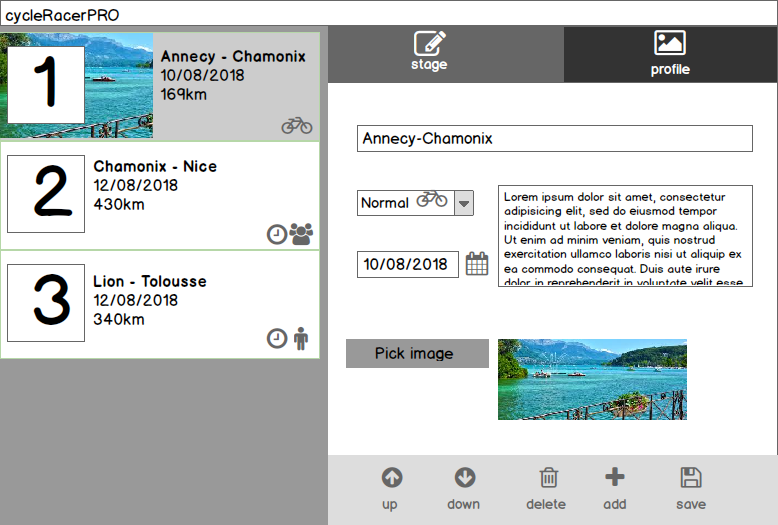
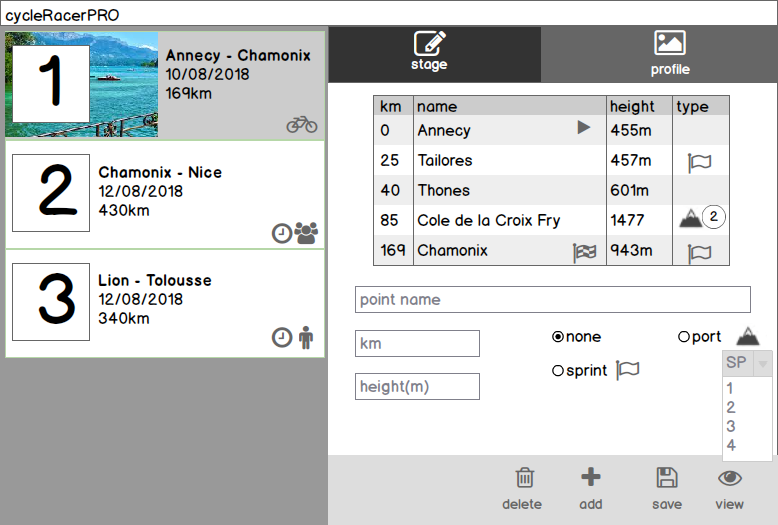
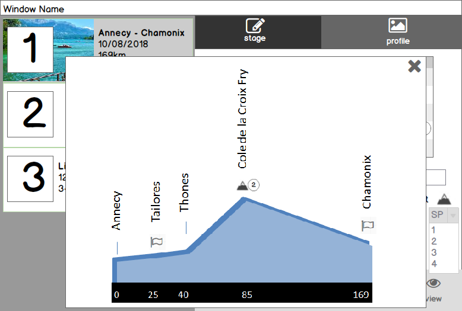

[ ... back  ](../README.md)

# Pràctica "cycleRacePRO"

__OBJECTIU:__ En aquesta pràctica construirem una petita aplicació que permetrà gestionar una cursa per etapes. En aquesta primera versió ens ocuparem de l'eina que permet crear etapes i editar-ne el seu perfil:

## Model de dades i projecte base
L'aplicació seguirà el següent model de dades, que es subministra ja preimplementat en 
el projecte que podeu descarregar [aqui](cycleRacerPRO.zip).
 
## Definició de la interfície d'usuari
### Splash screen
Engegarem una pantalla de presentació "splash screen" abans de carregar la primera pantalla:


### Editor d'etapes 
L'editor d'etapes és una gestió ( alta, baixa i modificació ) d'etapes d'una cursa ciclista.
L'Etapa és una entitat complexa i s'edita en dues parts:
- dades bàsiques
- perfil de l'etapa ( llista de punts kilomètrics rellevants)

#### Estructura global

- A l'esquerra sempre es mostrarà la llista d'etapes existents en un _ListView_.
- Cada element dins del _ListView_ serà un control personalitzat, i es connectarà a un objecte _Etapa_.
- Usarem el patró ["Tabs and Pivots"](https://docs.microsoft.com/en-us/windows/uwp/controls-and-patterns/tabs-pivot), per permetre
seleccionar entre l'edició de les dades bàsiques de l'etapa i el seu perfil.
    - **IMPORTANT:** Cada _Tab_ contindrà un _Frame_ on es carregarà una pàgina específica, _Etapa_DadesBasiques.xaml_ i _Etapa_Perfils.xaml__
- Les barres d'eines que podem veure a les dues pantalles es faran usant el patró ["Command Bar"](https://docs.microsoft.com/en-us/windows/uwp/controls-and-patterns/app-bars)

#### a) Dades bàsiques

Alguns comentaris:
- Tots els camps són obligatoris. El nom he de tenir 3 caràcters com a mínim.
- si les dades no són correctes, es marca el control amb un fons vermell suau, i la icona de desar queda deshabilitada.
- El desplegable mostra text i imatge ( us caldrà modificar el _DataTemplate__ del _ComboBox__)
- Quan seleccioneu _Pick Image_ es mostrarà un _File Picker_ per tal que l'usuari pugui seleccionar una imatge.
Trobareu més a sota a l'annex el codi per a fer aquesta feina.

#### b) Perfils


#### c) Visió de perfil 
Quan premem la icona de l'ull a l'edició del perfil, es mostra en un 
_PopUp_ (vegeu [aquí](https://code.msdn.microsoft.com/windowsapps/Popup-Control-in-universel-700d46d4) per més detalls ) un gràfic de l'etapa:

Aquest gràfic és integrament un control personalitzat que cal implementar.


## Annex: code snippets:
### FilePicker
```c#
        /// Obrir un selector d'arxius, triar un arxiu i copiar-lo a la carpeta ApplicationData del
        /// programa. Crear una imatge en memòria a partir de l'arxiu.
        private async void btnFile1_Click(object sender, RoutedEventArgs e)
        {
                FileOpenPicker fp = new FileOpenPicker();
                fp.FileTypeFilter.Add(".jpg");
                fp.FileTypeFilter.Add(".png");

                StorageFile sf = await fp.PickSingleFileAsync();
                // Cerca la carpeta de dades de l'aplicació, dins de ApplicationData
                var folder = ApplicationData.Current.LocalFolder;
                // Dins de la carpeta de dades, creem una nova carpeta "icons"
                var iconsFolder = await folder.CreateFolderAsync("icons", CreationCollisionOption.OpenIfExists);
                // Creem un nom usant la data i hora, de forma que no poguem repetir noms.
                string name = (DateTime.Now).ToString("yyyyMMddhhmmss") + "_" + sf.Name;
                // Copiar l'arxiu triat a la carpeta indicada, usant el nom que hem muntat
                StorageFile copiedFile = await sf.CopyAsync(iconsFolder, name);
                // Crear una imatge en memòria (BitmapImage) a partir de l'arxiu copiat a ApplicationData
                BitmapImage tmpBitmap = new BitmapImage(new Uri(copiedFile.Path));
			// ..... YOUR CODE HERE ...........
        }
		
	
		
```		